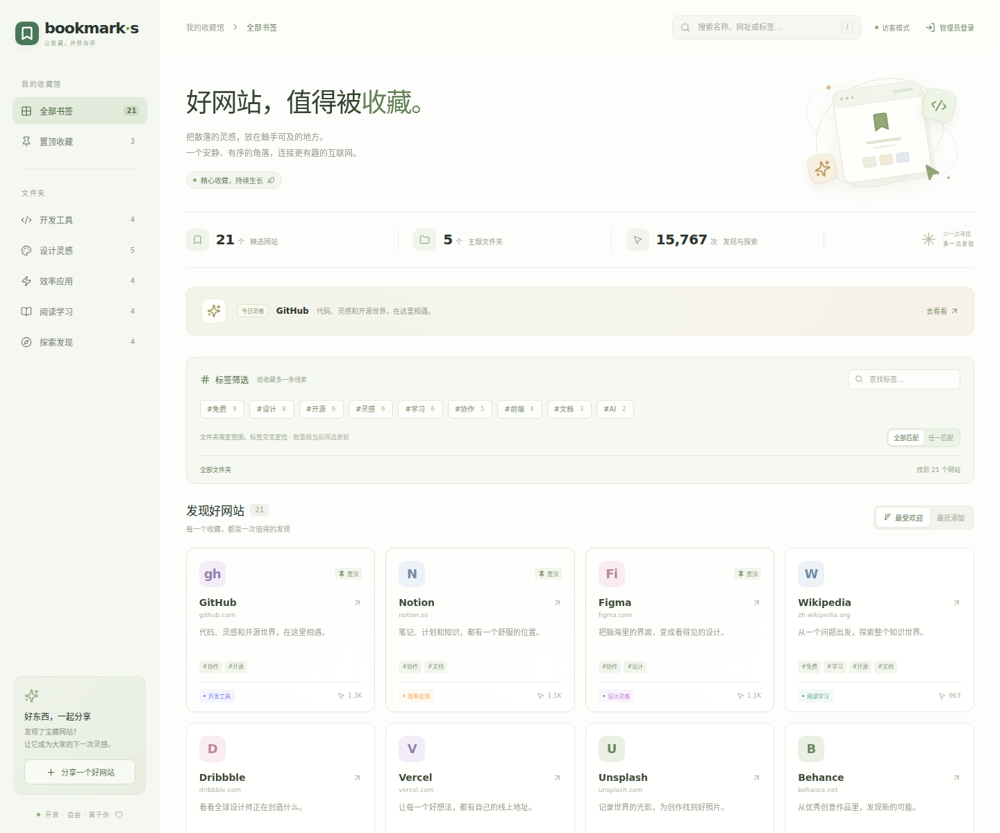

# bookmark-s

一个可以自己部署的书签导航站，用文件夹、标签、搜索和点击热度整理常用网站。页面铺满浏览器，书签列数随可用宽度自动调整，手机上使用抽屉导航；游客可以浏览、访问和推荐网站，管理员负责收藏与整理。



## 已实现

- **文件夹 + 标签双索引**：每个书签属于一个文件夹，同时可有多个标签；文件夹、标签和关键词可以组合筛选。
- 标签支持「全部匹配」（同时包含所选标签）和「任一匹配」（包含其中任一标签）；可查找标签、移除筛选条件，或单独查看「未打标签」的书签。
- 搜索覆盖网站名称、网址、介绍、文件夹名称和标签；首次显示 36 个匹配结果，可继续加载，搜索和筛选始终覆盖全部书签。
- 默认置顶书签优先，其余按累计点击量降序排列；也可切换最近添加。
- 点击书签会记录访问次数，数据保存在数据库中。
- 管理员登录后添加、编辑、删除和置顶书签，创建文件夹；在表单中选取已有标签或输入新标签。
- 管理员可批量添加、移除标签，也可创建、重命名、删除标签；删除标签会保留网站。
- 游客提交网站推荐时也可以填写标签，管理员在收件箱查看并处理推荐；通过审核后才公开展示推荐及其标签。
- 内置示例文件夹、书签与标签，首次运行即可体验。
- 一套前端与 API，支持 **VPS + SQLite** 和 **Cloudflare Workers + D1**。

这是一个单管理员的最小可用版本，适合个人书签站；点击量统计的是本站链接的点击次数，不是去重访客数。

## 本地快速体验

需要 **Node.js 24** 和 npm。项目使用 Node 内置 SQLite，无需单独安装数据库。

```bash
npm install
npm run dev
```

打开 **http://localhost:5173**。首次启动会自动创建 `data/bookmark-s.sqlite` 并写入示例数据。内置网站的初始点击数是用于展示排序的演示数据；之后的点击会在此基础上累加，新添加的书签从 0 开始。

开发环境管理员账号：

```text
用户名：admin
密码：bookmark-s-demo
```

开发环境无需配置 `.env`。如果已有 `.env`，其中的账号配置会覆盖默认值。前端运行在 5173，API 运行在 8787；Vite 会代理 `/api` 请求。

可以按以下流程验收：打开一个书签并查看点击数变化；使用侧栏的「分享一个好网站」提交推荐（手机上先打开左上角菜单）；登录管理员，在收件箱查看推荐，添加一个书签并置顶；刷新页面或重启服务，确认数据仍在。

## 用文件夹和标签整理收藏

文件夹适合表达主要归属，例如「开发工具」「阅读学习」；标签适合表达跨文件夹的用途或特点，例如「免费」「开源」「前端」「稍后阅读」。一个网站只放进一个文件夹，但可以同时标记「免费」「开源」「前端」。每个书签最多 12 个标签，每个标签最多 24 个字符，重复名称会自动合并。

先点侧栏文件夹缩小范围，再选标签继续筛选。例如选中「开发工具」，再选「免费」和「前端」，默认的「全部匹配」只显示同时符合这两个标签的网站；切换「任一匹配」会显示符合任意一个标签的网站，范围仍受当前文件夹限制。关键词可以继续缩小结果，也可以直接搜索标签名。标签旁的数量会随当前筛选变化，数量为 0 的标签不会出现在可选列表中；标签搜索和「更多标签」也只在当前范围内查找。已选标签即使没有匹配结果，仍可在筛选条件栏中取消。

登录后，添加或编辑书签时可点击已有标签，也可输入新名称并按 Enter 或逗号添加；直接保存也会收录尚未提交的标签输入。大量旧书签可以先筛选「未打标签」，点「批量整理」，勾选网站后添加标签；一次最多选择 200 个。「选择当前显示的书签」只选择已显示的卡片，继续加载后可以再选择。批量添加保留原有标签，批量移除只移除指定标签。切换文件夹、标签或关键词会清空勾选，避免误改隐藏的网站。

「管理标签」可以统一修改标签名称，相关书签会同步更新；删除标签只解除标签关联，文件夹、网站、点击数和置顶状态都会保留。

### 从旧版本升级

Node / Docker 在启动时自动执行标签迁移，保留已有书签、文件夹、点击数和置顶状态。原有分类会直接作为文件夹继续使用。内置示例网站会获得演示标签，自行收藏的网站保留为空标签，方便逐步整理；后续启动不会覆盖已经编辑的标签。

Cloudflare D1 需要先应用新增的 `migrations/0002_tags.sql`，再部署新版：

```bash
npm run cf:db:migrate
npm run cf:deploy
```

本地 Worker 使用 `npm run cf:db:migrate:local`。迁移不需要删除或重建数据库。

## VPS 部署

### 使用 Docker Compose

先复制配置文件，并把 `ADMIN_PASSWORD` 和 `SESSION_SECRET` 改为你自己的值：

```bash
cp .env.example .env
# 生成 SESSION_SECRET，再把输出填写到 .env
openssl rand -hex 32
```

`ADMIN_PASSWORD` 至少 10 个字符，`SESSION_SECRET` 至少 32 个字符。随后运行：

```bash
docker compose up -d --build
docker compose logs -f app
```

服务监听 **http://127.0.0.1:8787**，数据库保存在 Docker 命名卷中。将域名通过 Caddy 或 Nginx 反向代理到这个地址，并配置 HTTPS。在 `.env` 中设置 `PUBLIC_URL=https://bookmarks.example.com`（替换为你的域名，不含路径），再执行 `docker compose up -d`，让 API 正确校验浏览器请求的来源。例如 Caddy：

```caddyfile
bookmarks.example.com {
    reverse_proxy 127.0.0.1:8787
}
```

生产环境的登录 Cookie 默认只通过 HTTPS 发送。如果只是本机通过 HTTP 验证 Docker，在 `.env` 中临时添加 `SECURE_COOKIES=false`，然后重新执行 `docker compose up -d`。正式 HTTPS 部署时删除该配置。

更新代码后再次运行 `docker compose up -d --build` 即可；不要用 `docker compose down -v`，它会删除数据库卷。

### 直接使用 Node.js

准备好上述 `.env` 后执行：

```bash
npm ci
npm run build
npm start
```

`npm start` 以生产模式运行，同时提供构建后的网页与 API，默认端口 8787。可用 systemd 或你熟悉的进程管理器保持运行，并按上面的方式配置 HTTPS 反向代理。

## Cloudflare 部署

Cloudflare 方案使用 **Workers 静态资源 + Worker API + D1 数据库**，不依赖 VPS，也不是仅上传静态文件到 Pages。

### 先在本机测试 Worker

```bash
npm install
cp .env.example .dev.vars
# 编辑 .dev.vars，设置 ADMIN_PASSWORD 和 SESSION_SECRET
npx wrangler d1 migrations apply bookmark-s --local
npm run cf:dev
```

打开 Wrangler 输出的本地地址。这里使用独立的本地 D1 数据库，与 Node 的 `data/` 互不共享。`.dev.vars` 中的账号会用于登录。`wrangler.jsonc` 的占位数据库 ID 可用于本地测试。

### 部署到 Cloudflare

```bash
npx wrangler login
npm run cf:db:create
```

将命令返回的 **`database_id`** 填入 `wrangler.jsonc`，替换全零占位值。`database_name` 保持 `bookmark-s`。然后运行：

```bash
npm run cf:db:migrate
npx wrangler secret put ADMIN_PASSWORD
npx wrangler secret put SESSION_SECRET
npm run cf:deploy
```

两个 `secret put` 命令会分别提示输入密码和随机密钥；长度要求与 VPS 相同。用户名默认 `admin`，可在 `wrangler.jsonc` 的 `vars.ADMIN_USERNAME` 中修改。`.dev.vars` 只服务本地开发，不会替你配置线上密钥。

首次 D1 迁移会创建表并写入示例数据。部署命令自动构建前端，成功后访问 Wrangler 返回的 Workers 地址，也可以在 Cloudflare 控制台绑定自己的域名。后续有新迁移时，先运行 `npm run cf:db:migrate`，再部署。

## 配置与数据

| 配置 | 默认值 / 要求 |
| --- | --- |
| `ADMIN_USERNAME` | `admin` |
| `ADMIN_PASSWORD` | 开发模式默认 `bookmark-s-demo`；生产 / Worker 必填，至少 10 个字符 |
| `SESSION_SECRET` | Node 开发模式内置；生产 / Worker 必填，至少 32 个字符 |
| `HOST` | Node 默认 `0.0.0.0` |
| `PORT` | Node 默认 `8787` |
| `DB_PATH` | Node 默认 `data/bookmark-s.sqlite` |
| `SECURE_COOKIES` | Node 生产模式默认开启；本机 HTTP 测试可设为 `false` |
| `PUBLIC_URL` | HTTPS 反向代理部署时填写公开站点来源，如 `https://bookmarks.example.com`，不含路径 |

Node 会自动加载项目根目录的 `.env`。Cloudflare 本地读取 `.dev.vars`，线上通过 Wrangler secrets 和 bindings 配置。修改管理员密码或会话密钥后重启 / 重新部署服务；修改会话密钥会使已有登录失效。

**备份：**直接运行 Node 时，先停止进程，再备份整个 `data/` 目录。Docker 可以短暂停机后复制数据目录：

```bash
docker compose stop app
docker compose cp app:/app/data ./backups
docker compose start app
```

Cloudflare D1 可导出为 SQL：

```bash
npx wrangler d1 export bookmark-s --remote --output=bookmark-s-backup.sql
```

备份文件包含站点数据，请放在仓库之外妥善保存。首次初始化后不会因重启重新插入示例书签；运行时数据与代码分离。

## 开发

```bash
npm run typecheck
npm test
npm run build
```

浏览器端到端测试覆盖访客搜索与点击、推荐审核、管理员书签管理、手机端菜单，以及文件夹与标签交叉筛选、全部 / 任一匹配、标签编辑持久化、批量整理、标签重命名 / 删除和 600 个书签的渐进显示与全量搜索。测试使用独立的临时数据库，不会读写 `data/` 中的收藏：

```bash
npx playwright install --with-deps chromium
npm run test:e2e
```

| 路径 | 用途 |
| --- | --- |
| `src/` | React 前端与样式 |
| `server/` | 共享 Hono API、Node 服务和 API 测试 |
| `worker/` | Cloudflare Worker 入口 |
| `migrations/` | 数据库表结构和初始数据 |
| `wrangler.jsonc` | Cloudflare Workers 与 D1 配置 |
| `compose.yaml` / `Dockerfile` | VPS 容器部署 |

`GET /api/health` 可用于检查服务是否存活。开发 API 与前端通过 Vite 代理保持同源；生产由同一服务提供，管理员会话使用 HttpOnly Cookie。

## License

[MIT](LICENSE)
